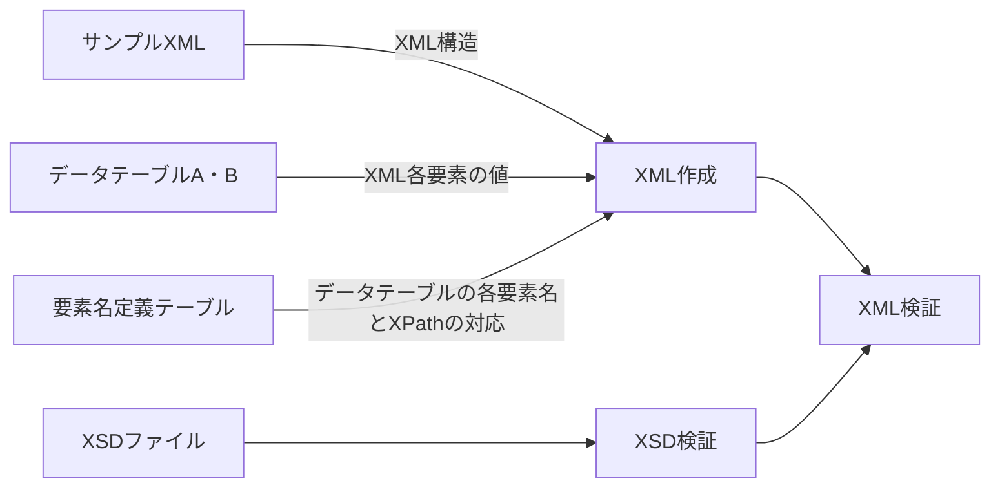

# ExcelToXML
テーブル形式のメタデータを入力スキーマに従ってXMLファイルへ変換する。Convert table-format data to XML files following the input schema.
プログラムはサンプルXMLファイルに従ってXMLデータ構造を定義する。要素名定義テーブルで指定されるXPathに従い、データ構造の中へデータテーブルA・Bの値を入力する。それにより複数のXMLデータを一括生成する。それらのXSDデータに対するvalidationを行う。
各テーブルはエクセルファイルで用意する。各セルの書式は全て文字列で与える。

## 入力データ
### サンプルXMLファイル
XML構造をプログラムに与えるためのタグ構造のみのXML。各要素の値は入っていないものとする。XSDではなくサンプルXMLで構造を与えることで、大規模なXSDを全て読み込むことを避ける。既存のXMLファイルから値を削除するか、XSDファイルから一般的なXMLエディタで作成できる。
### データテーブルA・B（DataTable_A.xlsx, DataTable_B.xlsx）
テーブル形式のメタデータ。要素名と各要素の値。
各出力XMLファイルで共通の項目はテーブルAで与えられ、個別に異なる値はテーブルBで与えられる。
要素名と値の階層構造はテーブルA・BのElement Name欄でセルの結合を使用して表現される。
データテーブルA・BでElement Name欄が使う列数（要素名の入れ子階層）は可変なので、終了列をB1セルで指定する。
出力ファイル名はテーブルBの１行目で指定する。出力されるXMLファイルの数はテーブルBのファイル名の数Nで決まる。
下記の例でイタリック体がユーザーが入力するべき項目。
#### データテーブルA
<table border="1" cellspacing="0" cellpadding="5">
  <thead>
    <tr>
      <td>Element Name End</td>
      <td>B</td>
      <td></td>
    </tr>
    <tr>
      <th colspan="2" style="background-color:#d0d9e6;"><strong>Element Name</strong></th>
      <th></th>
    </tr>
  </thead>
  <tbody>
    <tr>
      <td colspan="2">要素名A-1</td>
      <td>値1</td>
    </tr>
    <tr>
      <td rowspan="2">要素名A-2</td>
      <td>要素名A-2-1</td>
      <td>値2-1</td>
    </tr>
    <tr>
      <td>要素名A-2-2</td>
      <td>値2-2</td>
    </tr>
    <tr>
      <td>要素名A-3</td>
      <td>要素名A-3</td>
      <td>値3</td>
    </tr>
    <tr>
      <td>...</td>
      <td></td>
      <td></td>
    </tr>
  </tbody>
</table>

#### データテーブルB
<table border="1" cellspacing="0" cellpadding="5">
  <thead>
    <tr>
      <th>Element Name End</th>
      <th>B</th>
      <th></th>
      <th></th>
      <th></th>
      <th></th>
    </tr>
    <tr>
      <th colspan="2">Output File</th>
      <th>ファイル名1</th>
      <th>ファイル名2</th>
      <th>...</th>
      <th>ファイル名N</th>
    </tr>
    <tr>
      <th colspan="2" style="background-color:#d0d9e6;"><strong>Element Name</strong></th>
      <th></th>
      <th></th>
      <th></th>
      <th></th>
    </tr>
  </thead>
  <tbody>
    <tr>
      <td colspan="2">要素名B-1</td>
      <td>値1</td>
      <td>値1</td>
      <td></td>
      <td>値1</td>
    </tr>
    <tr>
      <td rowspan="2">要素名B-2</td>
      <td>要素名B-2-1</td>
      <td>値2-1</td>
      <td>値2-1</td>
      <td></td>
      <td>値2-1</td>
    </tr>
    <tr>
      <td>要素名B-2-2</td>
      <td>値2-2</td>
      <td>値2-2</td>
      <td></td>
      <td>値2-2</td>
    </tr>
    <tr>
      <td>要素名B-3</td>
      <td>要素名B-3-1</td>
      <td>値3</td>
      <td>値3</td>
      <td></td>
      <td>値3</td>
    </tr>
    <tr>
      <td>...</td>
      <td></td>
      <td></td>
      <td></td>
      <td></td>
      <td></td>
    </tr>
  </tbody>
</table>

### 要素名定義テーブル（ElementDefine.xlsx）
データテーブルの要素名とサンプルXMLの各XPathの対応付けを定義する。
### XSDファイル
作成したXMLが従うべきスキーマ。
