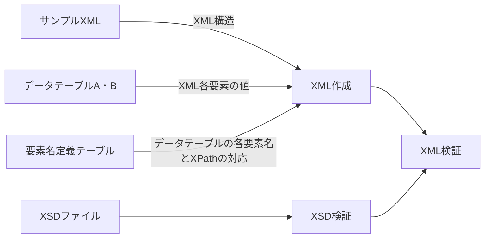

# ExcelToXML
テーブル形式のメタデータを入力スキーマに従ってXMLファイルへ変換する。Convert table-format data to XML files following the input schema.
プログラムはサンプルXMLファイルに従ってXMLデータ構造を定義する。要素名定義テーブルで指定されるXPathに従い、データ構造の中へデータテーブルA・Bの値を入力する。それにより複数のXMLデータを一括生成する。それらのXSDデータに対するvalidationを行う。
各テーブルはエクセルファイルで用意する。各セルの書式は全て文字列で与える。

## 入力データ
### サンプルXMLファイル
XML構造をプログラムに与えるためのタグ構造のみのXML。各要素の値は入っていないものとする。XSDではなくサンプルXMLで構造を与えることで、大規模なXSDを全て読み込むことを避ける。既存のXMLファイルから値を削除するか、XSDファイルから一般的なXMLエディタで作成できる。
### データテーブルA・B（DataTable_A.xlsx, DataTable_B.xlsx）
テーブル形式のメタデータ。要素名と各要素の値。
### 要素名定義テーブル（ElementDefine.xlsx）
データテーブルの要素名とサンプルXMLの各XPathの対応付けを定義する。
### XSDファイル
作成したXMLが従うべきスキーマ。
