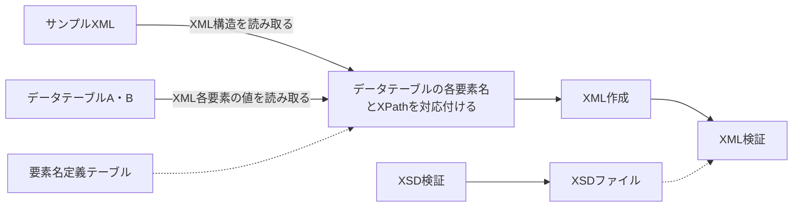

# ExcelToXML
テーブル形式のメタデータを入力スキーマに従ってXMLファイルへ変換する。Convert table-format data to XML files following the input schema.

```mermaid
flowchart LR
A[サンプルXML] -->|XML構造を読み取る| C[データテーブルの各要素名とXPathを対応付ける]
B[データテーブルA・B] -->|XML各要素の値を読み取る| C
D[要素名定義テーブル] -.-> C
C --> E[XML作成]
E --> F[XML検証]
G[XSD検証] --> H[XSDファイル]
H -.-> F
```
