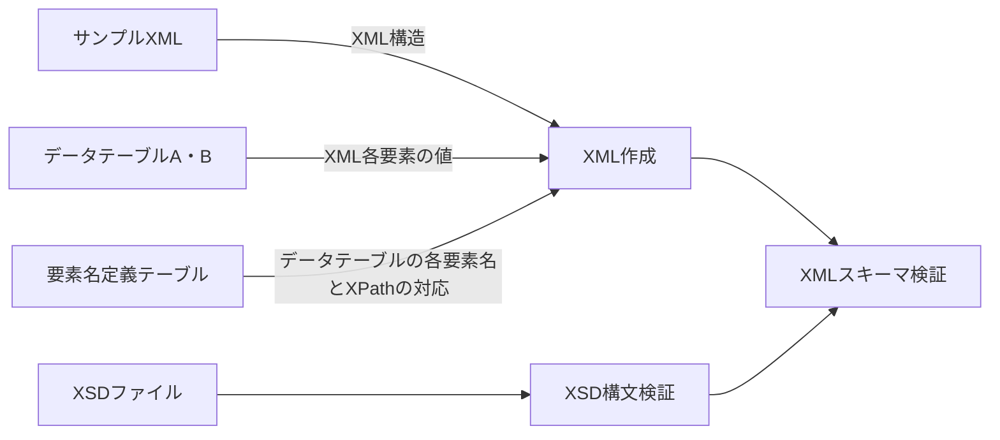

# ExcelToXml
テーブル形式のメタデータを入力スキーマに従ってXMLファイルへ変換する。Convert table-format data to XML files following the input schema.<br>
プログラムはサンプルXMLファイルに従ってXMLデータ構造を定義する。要素名定義テーブルで指定されるXPathに従い、データ構造の中へデータテーブルA・Bの値を入力する。作成したXMLファイルのスキーマ（XSD）に対する妥当性検証を行う。各テーブルはエクセルファイルとし、各セルの書式は全て文字列で与える。<br>
あるXSDスキーマに対してサンプルXMLと要素名定義テーブルを一度作っておけば、エクセル表形式のメタデータ（データテーブルA・B）からXMLへの変換をコマンド１つで行えるようになる。また、複数のXMLファイルを一括生成できる。



## 環境要件
.NET 8.0.3以上

## 入力データ
### サンプルXMLファイル
XML構造をプログラムに与えるためのタグ構造のみのXML。XSDファイルで指定されるスキーマに従っていること。各要素の値は入っていないものとする。ユーザーが使用するXML構造のみの記述で良い。XSDではなくサンプルXMLで構造を与えることで、大規模なXSDを毎回読み込むことを避ける。既存のXMLファイルから値を削除するか、XSDファイルから一般的なXMLエディタで作成できる。

### データテーブルA・B
テーブル形式のメタデータ。要素名と各要素の値。
各出力XMLファイルで共通の項目はテーブルAで与えられ、個別に異なる値はテーブルBで与えられる。
要素名と値の階層構造はテーブルA・BのElement Name欄でセルの結合を使用して表現される。
データテーブルA・BでElement Name欄が使う列数（要素名の階層数）は可変なので、終了列をエクセルのB1セルで指定する。
出力ファイル名はテーブルBの１行目で指定する。出力されるXMLファイルの数はテーブルBのファイル名の数Nで決まる。

#### データテーブルA
<table border="1" cellspacing="0" cellpadding="5">
  <tbody>
    <tr>
      <td style="background-color:#d0d9e6;"><strong>Element Name End</strong></td>
      <td>B</td>
      <td></td>
    </tr>
    <tr>
      <td colspan="2" style="background-color:#d0d9e6;"><strong>Element Name</strong></td>
      <td></td>
    </tr>
    <tr>
      <td colspan="2">要素名A-1</td>
      <td>値1</td>
    </tr>
    <tr>
      <td rowspan="2">要素名A-2</td>
      <td>要素名A-2-1</td>
      <td>値2-1</td>
    </tr>
    <tr>
      <td>要素名A-2-2</td>
      <td>値2-2</td>
    </tr>
    <tr>
      <td>要素名A-3</td>
      <td>要素名A-3</td>
      <td>値3</td>
    </tr>
    <tr>
      <td>...</td>
      <td></td>
      <td></td>
    </tr>
  </tbody>
</table>

#### データテーブルB
<table border="1" cellspacing="0" cellpadding="5">
  <tbody>
    <tr>
      <td style="background-color:#d0d9e6;"><strong>Element Name End</strong></td>
      <td>B</td>
      <td></td>
      <td></td>
      <td></td>
      <td></td>
    </tr>
    <tr>
      <td colspan="2" style="background-color:#d0d9e6;"><strong>Output File</strong></td>
      <td>ファイル名1</td>
      <td>ファイル名2</td>
      <td>...</td>
      <td>ファイル名N</td>
    </tr>
    <tr>
      <td colspan="2" style="background-color:#d0d9e6;"><strong>Element Name</strong></td>
      <td></td>
      <td></td>
      <td></td>
      <td></td>
    </tr>
    <tr>
      <td colspan="2">要素名B-1</td>
      <td>値1</td>
      <td>値1</td>
      <td></td>
      <td>値1</td>
    </tr>
    <tr>
      <td rowspan="2">要素名B-2</td>
      <td>要素名B-2-1</td>
      <td>値2-1</td>
      <td>値2-1</td>
      <td></td>
      <td>値2-1</td>
    </tr>
    <tr>
      <td>要素名B-2-2</td>
      <td>値2-2</td>
      <td>値2-2</td>
      <td></td>
      <td>値2-2</td>
    </tr>
    <tr>
      <td>要素名B-3</td>
      <td>要素名B-3-1</td>
      <td>値3</td>
      <td>値3</td>
      <td></td>
      <td>値3</td>
    </tr>
    <tr>
      <td>...</td>
      <td></td>
      <td></td>
      <td></td>
      <td></td>
      <td></td>
    </tr>
  </tbody>
</table>

### 要素名定義テーブル
データテーブルの要素名とサンプルXMLの各XPathの対応付けを定義する。要素名の階層構造はスラッシュ（/）で表し、子要素名のXPathの開始タグがサブツリーの起点となる。ある要素の繰り返しがあり、かつ繰り返される起点がその要素の上位タグの場合、繰り返しの起点（maxOccurs>1の要素）もその親要素として記入する必要があることに注意。（サンプルISOのキーワード要素の記述法などを参照。）

<table border="1" cellspacing="0" cellpadding="5">
  <thead style="background-color:#3f66a7; color:white;">
    <tr>
      <th>Element Name</th>
      <th>XPath</th>
    </tr>
  </thead>
  <tbody>
    <tr>
      <td>要素名A-1</td>
      <td>パスA-1</td>
    </tr>
    <tr>
      <td>要素名A-2</td>
      <td>パスA-2</td>
    </tr>
    <tr>
      <td>要素名A-2/要素名A-2-2</td>
      <td>パスA-2-2（パスA-2の続き）</td>
    </tr>
    <tr>
      <td>…</td>
      <td></td>
    </tr>
    <tr>
      <td>要素名B-1</td>
      <td>パスB-1</td>
    </tr>
    <tr>
      <td>…</td>
      <td></td>
    </tr>
  </tbody>
</table>

### XSDファイル
作成したXMLが従うべきスキーマファイル。


## 使い方
### ビルド
ソリューションフォルダ（ExcelToXml）で
```
dotnet build
```

### 実行
#### モード1
データテーブルを要素名定義テーブルとサンプルXMLに従ってXMLファイルへ変換する。-xオプションが指定された場合は各XMLファイルに対してXSD妥当性検証を行う。
```
dotnet run --project <ソリューションフォルダのパス>/ExcelToXml.Console -- -a <データテーブルAのパス> -b <データテーブルBのパス> -s <サンプルXMLのパス> -e <要素名定義テーブルのパス> -x <XSDファイルのパス> -o <出力先パス>
```
#### モード2
既存のXMLファイルに対してXSD妥当性検証を行う。
```
dotnet run --project <ソリューションフォルダのパス>/ExcelToXml.Console -- --xmlfiles <xmlファイルのパス1> <xmlファイルのパス2> -x <XSDファイルのパス>
```

#### コマンド引数
|      | 省略形 |     |
| ---- | ------ | ---- |
| --datatable_a    | -a | データテーブルAのパス |
| --datatable_b    | -b | データテーブルBのパス |
| --sample_xml     | -s | サンプルXMLのパス |
| --element_define | -e | 要素名定義テーブルのパス |
| --xsd            | -x | XSDのルートファイルのパス |
| --xsdfolder      |    | 全てのXSDファイルが格納されているフォルダ。--xsdオプションで指定されるXSDルートファイルと同じフォルダに格納されている場合、省略可。
| --output         | -o | 出力先フォルダ |
| --xmlfiles       |    | 入力XMLファイルのパス。モードCの場合のみ使用。 |
| --info           |    | 実行中処理の詳細を出力する |
| --nowarning      |    | 警告メッセージを表示しない |

