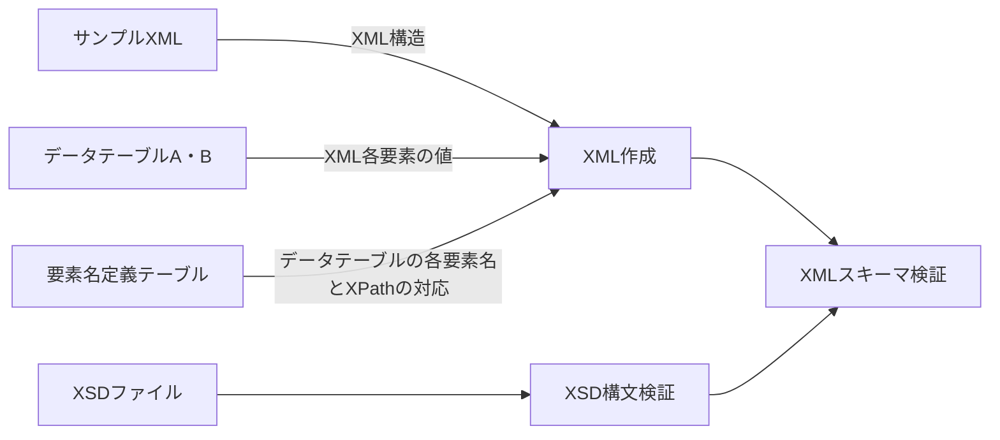

---

---

<h1 id="exceltoxml">ExcelToXML</h1>

テーブル形式のメタデータを入力スキーマに従ってXMLファイルへ変換する。Convert table-format data to XML files following the input schema.  
プログラムはサンプルXMLファイルに従ってXMLデータ構造を定義する。要素名定義テーブルで指定されるXPathに従い、データ構造の中へデータテーブルA・Bの値を入力する。それにより複数のXMLデータを一括生成できる。作成したXMLファイルのスキーマ（XSD）に対する妥当性検証を行う。 
各テーブルはエクセルファイルで用意する。各セルの書式は全て文字列で与える。

<h2 id="入力データ">入力データ</h2>
<h3 id="サンプルxmlファイル">サンプルXMLファイル</h3>

XML構造をプログラムに与えるためのタグ構造のみのXML。XSDファイルで指定されるスキーマに従っていること。各要素の値は入っていないものとする。ユーザーが使用するXML構造のみの記述で良い。XSDではなくサンプルXMLで構造を与えることで、大規模なXSDを全て読み込むことを避ける。既存のXMLファイルから値を削除するか、XSDファイルから一般的なXMLエディタで作成できる。

<h3 id="データテーブルa・b（datatable_a.xlsx-datatable_b.xlsx）">データテーブルA・B（DataTable_A.xlsx, DataTable_B.xlsx）</h3>

テーブル形式のメタデータ。要素名と各要素の値。 
各出力XMLファイルで共通の項目はテーブルAで与えられ、個別に異なる値はテーブルBで与えられる。 
要素名と値の階層構造はテーブルA・BのElement Name欄でセルの結合を使用して表現される。 
データテーブルA・BでElement Name欄が使う列数（要素名の入れ子階層）は可変なので、終了列をB1セルで指定する。 
出力ファイル名はテーブルBの１行目で指定する。出力されるXMLファイルの数はテーブルBのファイル名の数Nで決まる。

<h4 id="データテーブルa">データテーブルA</h4>
<table border="1" cellspacing="0" cellpadding="5">
  <tbody>
    <tr>
      <td><strong>Element Name End</strong></td>
      <td>B</td>
      <td></td>
    </tr>
    <tr>
      <td colspan="2"><strong>Element Name</strong></td>
      <td></td>
    </tr>
    <tr>
      <td colspan="2">要素名A-1</td>
      <td>値1</td>
    </tr>
    <tr>
      <td rowspan="2">要素名A-2</td>
      <td>要素名A-2-1</td>
      <td>値2-1</td>
    </tr>
    <tr>
      <td>要素名A-2-2</td>
      <td>値2-2</td>
    </tr>
    <tr>
      <td>要素名A-3</td>
      <td>要素名A-3</td>
      <td>値3</td>
    </tr>
    <tr>
      <td>...</td>
      <td></td>
      <td></td>
    </tr>
  </tbody>
</table>
<h4 id="データテーブルb">データテーブルB</h4>
<table border="1" cellspacing="0" cellpadding="5">
  <tbody>
    <tr>
      <td><strong>Element Name End</strong></td>
      <td>B</td>
      <td></td>
      <td></td>
      <td></td>
      <td></td>
    </tr>
    <tr>
      <td colspan="2"><strong>Output File</strong></td>
      <td>ファイル名1</td>
      <td>ファイル名2</td>
      <td>...</td>
      <td>ファイル名N</td>
    </tr>
    <tr>
      <td colspan="2"><strong>Element Name</strong></td>
      <td></td>
      <td></td>
      <td></td>
      <td></td>
    </tr>
    <tr>
      <td colspan="2">要素名B-1</td>
      <td>値1</td>
      <td>値1</td>
      <td></td>
      <td>値1</td>
    </tr>
    <tr>
      <td rowspan="2">要素名B-2</td>
      <td>要素名B-2-1</td>
      <td>値2-1</td>
      <td>値2-1</td>
      <td></td>
      <td>値2-1</td>
    </tr>
    <tr>
      <td>要素名B-2-2</td>
      <td>値2-2</td>
      <td>値2-2</td>
      <td></td>
      <td>値2-2</td>
    </tr>
    <tr>
      <td>要素名B-3</td>
      <td>要素名B-3-1</td>
      <td>値3</td>
      <td>値3</td>
      <td></td>
      <td>値3</td>
    </tr>
    <tr>
      <td>...</td>
      <td></td>
      <td></td>
      <td></td>
      <td></td>
      <td></td>
    </tr>
  </tbody>
</table>
<h3 id="要素名定義テーブル（elementdefine.xlsx）">要素名定義テーブル（ElementDefine.xlsx）</h3>

データテーブルの要素名とサンプルXMLの各XPathの対応付けを定義する。要素名の階層構造はスラッシュ（/）で表し、子要素名のXPathの開始タグがサブツリーの起点となる。ある要素の繰り返し（maxOccurs&gt;1）があり、かつ繰り返される起点がその要素の上位タグの場合、繰り返しの起点もその親要素として記入する必要があることに注意。（サンプルISOのキーワード要素の記述法などを参照。）

<table border="1" cellspacing="0" cellpadding="5">
  <thead>
    <tr>
      <th>Element Name</th>
      <th>XPath</th>
    </tr>
  </thead>
  <tbody>
    <tr>
      <td>要素名A-1</td>
      <td>パスA-1</td>
    </tr>
    <tr>
      <td>要素名A-2</td>
      <td>パスA-2</td>
    </tr>
    <tr>
      <td>要素名A-2/要素名A-2-2</td>
      <td>パスA-2-2（パスA-2の続き）</td>
    </tr>
    <tr>
      <td>…</td>
      <td></td>
    </tr>
    <tr>
      <td>要素名B-1</td>
      <td>パスB-1</td>
    </tr>
    <tr>
      <td>…</td>
      <td></td>
    </tr>
  </tbody>
</table>
<h3 id="xsdファイル">XSDファイル</h3>

作成したXMLが従うべきスキーマファイル。

